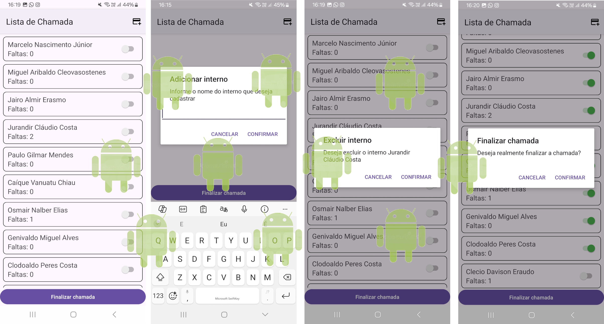
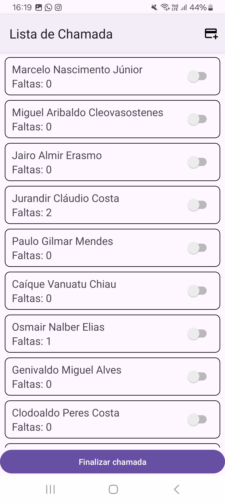
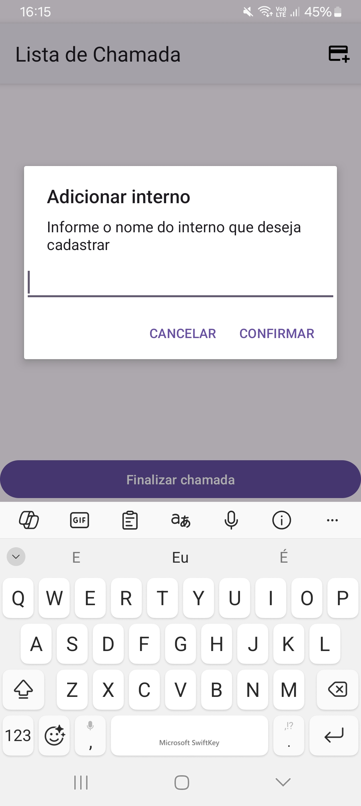
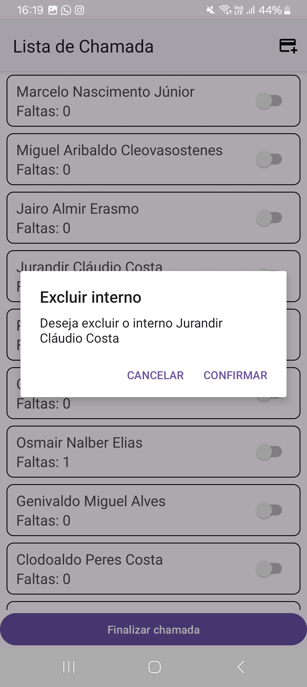
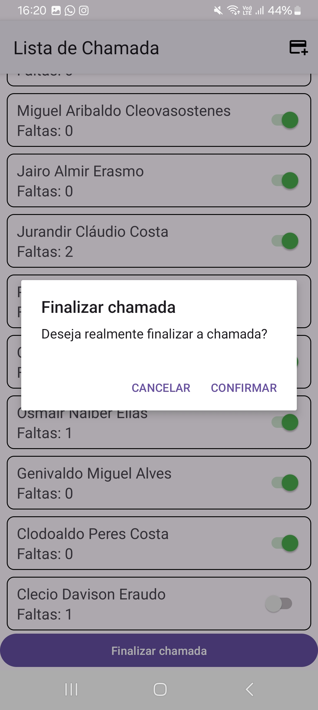

# Lista de Chamada

Aplicação desenvolvida em tecnologia Android Kotlin, que implementa sistema de gerenciamento de lista de presença.

- API 35 do SDK do Android

## Tela principal

## Caixa de diálogo(CD) do formulário adicionar

## CD confirmação de exclusão

## CD confirmação de cadastro de chamada

